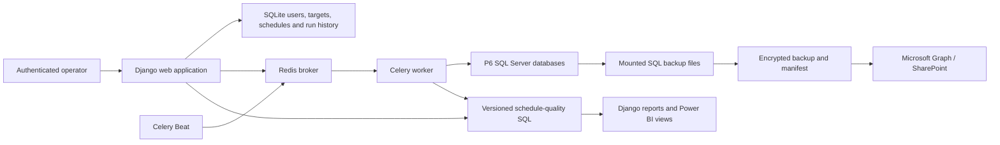

# P6BackupAdmin

P6BackupAdmin is a self-contained Django operations application for Primavera P6 SQL Server environments. It manages encrypted database backups and restores, SharePoint retention, recurring jobs, database maintenance, and SQL-backed schedule-quality reporting for Django and Power BI.

The application currently supports the AxialP6, Axial Training, and P62212 environments. Django stores application users, permissions, schedules, and run history in SQLite; P6 data and schedule-quality results remain in SQL Server.

## What it does

- Runs native SQL Server `BACKUP DATABASE ... WITH CHECKSUM` operations.
- Encrypts backup files in chunks with Fernet before they leave the server.
- Generates manifests and SHA-256 checksums for backup verification.
- Uploads encrypted backups and manifests to SharePoint through Microsoft Graph.
- Applies per-target SharePoint retention policies.
- Restores backups with hash verification, decryption, `RESTORE VERIFYONLY`, `FILELISTONLY`, and explicit `WITH MOVE` paths.
- Schedules backup, restore, and schedule-quality work through Celery, Redis, and `django-celery-beat`.
- Provides database-maintenance operations and auditable run histories.
- Presents schedule-quality overview, validation, evidence, and configuration pages.
- Publishes versioned schedule-quality configuration and materialised results atomically in SQL Server.
- Exposes Power BI-compatible schedule-quality views and task-level evidence.

## System overview



## Default backup targets

Running `bootstrap_p6_targets` creates the following target definitions:

| Target | Default database | Host port | Container backup mount | SharePoint folder |
| --- | --- | ---: | --- | --- |
| AxialP6 | `Axial` | `1466` | `/mnt/p6-backups/axialp6` | `P6 Backups/AxialP6` |
| Axial Training | `Axial_Training` | `1466` | `/mnt/p6-backups/axialp6` | `P6 Backups/Axial Training` |
| P62212 | `Axial` | `1433` | `/mnt/p6-backups/p62212` | `P6 Backups/P62212` |

Targets can be edited in the application after bootstrap. SQL Server Express compression must remain disabled.

## Backup and restore lifecycle

SQL Server writes the original backup into its own `/var/backups` mount:

```sql
BACKUP DATABASE [DatabaseName]
TO DISK = N'/var/backups/target_backup_YYYYMMDD_HHMMSS.bak'
WITH INIT, CHECKSUM;
```

P6BackupAdmin then:

1. Finds the same file through the application-side mounted backup path.
2. Calculates the original SHA-256 checksum.
3. Encrypts the file in chunks using the first configured Fernet key.
4. Writes a manifest containing the hashes and backup metadata.
5. Uploads the encrypted backup and manifest to SharePoint.
6. Optionally verifies the uploaded content and removes local staging files.
7. Applies the configured SharePoint retention policy.

A restore reverses that flow. It downloads the encrypted artifact and manifest, verifies hashes, attempts decryption with the configured key ring, runs `RESTORE VERIFYONLY` and `RESTORE FILELISTONLY`, and restores the database using explicit data and log destinations.

> [!IMPORTANT]
> Keep every historical key required by retained backups in `BACKUP_ENCRYPTION_KEYS`. Losing a key makes backups encrypted with that key unrecoverable.

## Technology

- Python 3.12
- Django 5
- Celery and `django-celery-beat`
- Redis 7
- Microsoft ODBC Driver 18 for SQL Server
- SQLite for application state
- SQL Server for P6 and schedule-quality data
- Microsoft Graph for SharePoint and optional email delivery
- Docker Compose for the application stack

## Repository layout

| Path | Purpose |
| --- | --- |
| `backups/` | Backup targets, orchestration, restore, retention, maintenance, reporting, views, tasks, migrations, and tests |
| `backups/services/` | Service-layer integrations and operational workflows |
| `backups/management/commands/` | Bootstrap, scheduling, backup, and permission commands |
| `graph/` | Microsoft Graph token and email helpers |
| `p6_backup_admin/` | Django settings, URLs, WSGI, and Celery bootstrap |
| `sql/schedule_quality/` | Versioned SQL Server forward, verification, reconciliation, and rollback scripts |
| `templates/` | Application, email, authentication, and report templates |
| `docker-compose.yml` | Web, Celery, Beat, Redis, volumes, ports, and external networks |
| `.env.example` | Safe environment-variable template |

Runtime databases, secrets, virtual environments, generated static files, deployment staging, rollback snapshots, and local QA captures are intentionally excluded from Git and Docker build contexts.

## Prerequisites

- Docker Desktop on Windows, or Docker Engine with the Compose plugin on Linux.
- Existing P6 SQL Server instances reachable from the application containers.
- Backup directories mounted into both SQL Server and P6BackupAdmin at their configured paths.
- The external Docker networks `AxialP6` and `p62212_default`.
- A Microsoft Entra application with appropriate Graph permissions when SharePoint upload or Graph email is enabled.

For a non-Docker development environment, install Python 3.12, Microsoft ODBC Driver 18, and the packages in `requirements.txt`.

## Configuration

Create the environment file from the committed template:

```bash
cp .env.example .env
```

Generate a Django secret and a Fernet encryption key rather than using development placeholders:

```bash
python -c "import secrets; print(secrets.token_urlsafe(64))"
python -c "from cryptography.fernet import Fernet; import json; print(json.dumps([Fernet.generate_key().decode()]))"
```

### Core settings

| Variable | Purpose | Typical/default value |
| --- | --- | --- |
| `DEBUG` | Django debug mode | `true` locally; `false` in production |
| `DJANGO_SECRET_KEY` | Django signing secret | Required in production |
| `ALLOWED_HOSTS` | Comma-separated hostnames/IPs | Local and deployed application hosts |
| `CSRF_TRUSTED_ORIGINS` | Comma-separated trusted origins | Full HTTP/HTTPS origins |
| `TIME_ZONE` | Django and Celery timezone | `Europe/London` |
| `SQLITE_PATH` | Application-state database path | `db.sqlite3` |
| `BACKUP_STAGING_ROOT` | Temporary backup working directory | `backup-temp` |
| `BACKUP_ENCRYPTION_KEYS` | JSON array of Fernet keys; first encrypts, all may decrypt | Required for real backup jobs |
| `BACKUP_KEEP_LOCAL` | Retain local encrypted artifacts | `false` |
| `BACKUP_VERIFY_SHAREPOINT_UPLOAD` | Download/verify uploaded artifacts | `false` |

### SQL Server settings

| Variable | Purpose | Default |
| --- | --- | --- |
| `P6_DEFAULT_SQL_HOST` | Default P6 SQL Server hostname | `host.docker.internal` |
| `P6_AXIALP6_SQL_PORT` | AxialP6 host port | `1466` |
| `P6_P62212_SQL_PORT` | P62212 host port | `1433` |
| `P6_AXIALP6_SQL_PASSWORD` | AxialP6 password referenced by a target | No default |
| `P6_P62212_SQL_PASSWORD` | P62212 password and schedule-quality fallback | No default |
| `P6_SCHEDULE_QUALITY_SQL_HOST` | Schedule-quality SQL host | `P6_DEFAULT_SQL_HOST` |
| `P6_SCHEDULE_QUALITY_SQL_PORT` | Schedule-quality SQL port | `P6_P62212_SQL_PORT` |
| `P6_SCHEDULE_QUALITY_SQL_DATABASE` | Reporting source database | `P62212_1` |
| `P6_SCHEDULE_QUALITY_SQL_USERNAME` | Reporting SQL login | `admin` |
| `P6_SCHEDULE_QUALITY_SQL_PASSWORD` | Reporting SQL password | Falls back to `P6_P62212_SQL_PASSWORD` |
| `P6_SCHEDULE_QUALITY_SQL_DRIVER` | ODBC driver name | `ODBC Driver 18 for SQL Server` |

### Scheduling and permissions

| Variable | Purpose | Default |
| --- | --- | --- |
| `P6_SCHEDULE_QUALITY_REFRESH_ENABLED` | Enables the Beat refresh task | `true` |
| `P6_SCHEDULE_QUALITY_REFRESH_SCHEDULE` | Five-part cron expression | `*/15 * * * *` |
| `P6_SCHEDULE_QUALITY_REFRESH_PROJ_ID` | Optional single-project scheduled refresh | All projects |
| `P6_SCHEDULE_QUALITY_PROFILE_CODE` | Active profile identifier | `default` |
| `P6_SCHEDULE_QUALITY_EDITOR_GROUP` | Django group allowed to edit/publish settings | `Schedule Quality Editors` |

### Microsoft Graph and email

| Variable | Purpose |
| --- | --- |
| `GRAPH_TENANT_ID` | Microsoft Entra tenant ID |
| `GRAPH_CLIENT_ID` | Application/client ID |
| `GRAPH_CLIENT_SECRET` | Application secret |
| `GRAPH_MAIL_SENDER` | Mailbox used for Graph email |
| `EMAIL_BACKEND` | Django email backend |
| `EMAIL_HOST`, `EMAIL_PORT` | SMTP connection |
| `EMAIL_HOST_USER`, `EMAIL_HOST_PASSWORD` | SMTP credentials |
| `EMAIL_USE_TLS` | Enable SMTP TLS |
| `DEFAULT_FROM_EMAIL` | Default sender address |

Never commit `.env`, encryption keys, SQL passwords, Graph credentials, SQLite databases, or backup artifacts.

## Start with Docker Compose

Set the host backup paths before starting the stack.

Windows PowerShell:

```powershell
$env:P6_AXIALP6_BACKUPS_PATH = "C:/Dev/P6/AxialP6/backups"
$env:P6_P62212_BACKUPS_PATH = "C:/Dev/P6/P62212/backups"
docker compose up -d --build
```

Ubuntu:

```bash
export P6_AXIALP6_BACKUPS_PATH=/home/AxialP6/backups
export P6_P62212_BACKUPS_PATH=/home/mat/P62212/backups
docker compose up -d --build
```

Initialise the application:

```bash
docker compose exec -T web python manage.py migrate --noinput
docker compose exec -T web python manage.py bootstrap_p6_targets
docker compose exec -T web python manage.py sync_backup_schedules
docker compose exec -T web python manage.py sync_schedule_quality_refresh
docker compose exec web python manage.py createsuperuser
```

Open `http://localhost:8026/` and sign in with the created superuser.

## Application areas

| Area | Path | Purpose |
| --- | --- | --- |
| Suite landing | `/` | Entry point for operational modules |
| Backup targets | `/backup-targets/` | Target status, schedules, run history, backup and restore |
| Maintenance | `/maintenance/` | Index, stale-session, log-retention, and user-data maintenance history/actions |
| Schedule Quality | `/schedule-quality/` | Schedule-quality landing and refresh controls |
| Overview | `/schedule-quality/overview/` | Project-level scorecard metrics |
| Validation | `/schedule-quality/validation/` | Detailed validation results and evidence |
| Settings | `/schedule-quality/settings/` | Shared draft, publish, and versioned rule configuration |

Authentication is required for operational pages. Schedule-quality editing and publication also require membership of the configured editor group.

Grant an existing Django user editor access:

```bash
docker compose exec -T web python manage.py grant_schedule_quality_editor USERNAME
```

## Useful management commands

```bash
# Create missing default targets
python manage.py bootstrap_p6_targets

# Also refresh connection/path defaults on existing targets
python manage.py bootstrap_p6_targets --update-existing

# Synchronise Celery Beat jobs from target schedules
python manage.py sync_backup_schedules

# Synchronise the schedule-quality Beat job from environment settings
python manage.py sync_schedule_quality_refresh

# Run one target immediately
python manage.py run_p6_backup p62212

# Allow a disabled target to run explicitly
python manage.py run_p6_backup p62212 --force

# Grant schedule-quality editor membership
python manage.py grant_schedule_quality_editor USERNAME
```

Prefix these commands with `docker compose exec -T web` when operating the Compose deployment.

## Schedule-quality reporting

Schedule-quality configuration and materialised reporting data are owned by SQL Server under the `powerbitables` schema. Django provides the authenticated editor, publisher, refresh controls, and report surfaces; it is not a second copy of the rules.

Editors work on a shared draft. Publication stages a complete rebuild using that draft and activates the configuration and materialised rows only after the full stage succeeds. A failed publication leaves the previously active configuration and results in place.

The SQL package includes:

- pre-deployment snapshots;
- versioned forward scripts;
- post-deployment assertions;
- canary and full-refresh support;
- project/task evidence views for Power BI;
- full reconciliation queries;
- targeted and full rollback scripts.

Read [`sql/schedule_quality/README.md`](sql/schedule_quality/README.md) before applying SQL assets. The scripts contain `GO` separators and require a GO-aware runner that keeps a single SQL connection open across batches. Always validate against a restored database first, take the documented snapshot, run every post-deployment assertion, use a canary project, and reconcile immediately after the full refresh while P6 imports are paused.

## Validation and tests

Run the Django configuration and migration checks:

```bash
docker compose exec -T web python manage.py check
docker compose exec -T web python manage.py makemigrations --check --dry-run
```

Run the full Django test suite:

```bash
docker compose exec -T web python manage.py test
```

Focused schedule-quality coverage:

```bash
docker compose exec -T web python manage.py test \
  backups.tests.test_schedule_quality_reporting \
  backups.tests.test_schedule_quality_sql_assets
```

For an isolated image check without a running Compose stack:

```bash
docker build -t p6backupadmin-check .
docker run --rm p6backupadmin-check python manage.py check
docker run --rm p6backupadmin-check python manage.py test
```

## Deployment

The production checkout can be updated from GitHub with a fast-forward-only pull:

```bash
cd /home/mat/P6BackupAdmin
git fetch origin main
git status --short
git pull --ff-only origin main
docker compose build
docker compose run --rm web python manage.py migrate --noinput
docker compose run --rm web python manage.py check
docker compose run --rm web python manage.py makemigrations --check --dry-run
docker compose up -d
docker compose ps
```

Before a deployment:

1. Confirm the local, GitHub, and production commit IDs.
2. Confirm the production worktree has no tracked modifications.
3. Preserve `.env`, SQLite state, and any files affected by the release in a timestamped rollback location.
4. Back up data stores before migrations or SQL deployments.
5. Validate the candidate image before restarting services.

After deployment, rerun checks/tests appropriate to the change, inspect container status/logs, and verify the authenticated application paths. Do not treat a successful HTTP redirect alone as full acceptance.

## Rollback and recovery

- Application rollback: restore the previous Git commit and rebuild/restart the affected services.
- Django state: restore the pre-deployment SQLite backup when a migration must be reversed through data recovery.
- Schedule-quality SQL: use only the rollback script paired with the deployed forward change and its required snapshot.
- Encrypted backups: retain old Fernet keys until no retained artifact depends on them.
- SQL restore: keep the manifest with its encrypted backup; both are required for integrity verification.

Never perform an application rollback by deleting the production directory or overwriting `.env` and runtime databases from Git.

## Security notes

- `.env` and its production variants are ignored by Git and Docker.
- Docker build context excludes databases, credentials, staging files, rollback snapshots, generated static files, and local QA artifacts.
- Backup encryption happens before SharePoint upload.
- Restore verifies both encrypted and decrypted content against the manifest.
- Operational routes require Django authentication and CSRF protection.
- Use `DEBUG=false`, a unique `DJANGO_SECRET_KEY`, explicit trusted hosts/origins, and least-privilege Graph permissions in production.
- Rotate Graph and SQL credentials through environment configuration, not source changes.
- Test backup restoration regularly; an untested backup is not a proven recovery path.

## Git workflow

`main` is the deployable branch. Keep commits focused, run the relevant checks before pushing, and never add runtime state or secrets to a commit. Production should normally consume GitHub changes with `git pull --ff-only`; production-only edits make future deployments ambiguous and should be avoided.

## Licence and support

No open-source licence has been granted in this repository. Unless a licence is added, the code remains all rights reserved. Operational ownership, deployment access, SQL credentials, encryption keys, and Microsoft Graph configuration are managed privately by the project owner.
